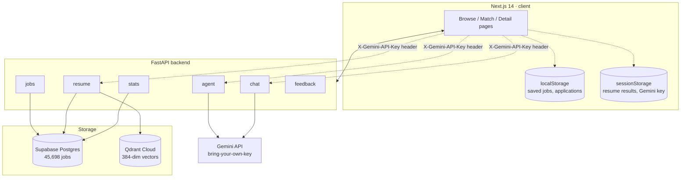

<div align="center">

# Smart Apply

<sub>[smartapply-cipher.vercel.app](https://smartapply-cipher.vercel.app)</sub>

**A resume-matching engine that scores every job against your actual skills, not your keywords.**

45,698 jobs indexed. Hybrid scoring across skill overlap, semantic similarity, and experience fit. Explainable end to end.

[](backend)
[](frontend)
[](https://qdrant.tech)
[](https://supabase.com)
[](LICENSE)

</div>

---

## The problem

Job boards return everything that matches a keyword and leave the ranking to you. A search for "Data Scientist" surfaces analysts, ML engineers, and BI leads in one undifferentiated list, and nothing on the page tells you why a result showed up or whether your resume is even close to qualifying.

Smart Apply inverts that. Upload a resume once, and every job in the corpus is scored against it directly: which of its required skills you have, which you don't, how close your experience is to what it asks for, and a plain-language verdict for each match. No result appears without a reason attached to it.

## What it actually does

| Capability | How |
| --- | --- |
| Resume-to-job matching | Hybrid score across skill overlap, semantic similarity, and experience alignment, reranked over a wide retrieval pool |
| Match verdicts | Deterministic templates built from the real matched/missing skill lists, not free-form LLM prose that can hallucinate a fit that isn't there |
| ATS resume check | Rule-based formatting and parseability audit, scored independent of any single job |
| Skill gap roadmap | A generated 7-day plan targeting the specific skills missing from your top match |
| Mock interview prep | Role-specific technical questions with difficulty tuning, cached per role |
| Resume bullet rewriting | Tailors existing bullets toward one target job's actual listed requirements |
| Job comparison | Side-by-side and N-way diffing across skills, salary bands, and experience level |
| Market intelligence | Live salary bands, trending skills, and role-category demand computed from the full corpus |
| Conversational agent | A chat interface that can pull job cards, run comparisons, and generate roadmaps mid-conversation via function calling |
| New-role digest | Surfaces jobs added since your last visit, ranked against your resume's skill profile |

## How a match happens

<div align="center">
  
</div>

Every component is inspectable on the results page: which skills matched, which are missing, and how the candidate's detected experience compares against what the role actually asks for. Experience alignment is graduated, not binary — a one-year gap and a six-year gap don't score the same, and a role with no stated experience requirement is flagged as unknown rather than silently scored as a perfect match.

## Under the hood



Frontend and backend are fully decoupled — the browser talks to FastAPI exclusively over HTTP, and no business logic lives in a Next.js API route. Every Gemini-backed feature runs bring-your-own-key: an end user's key lives only in browser session storage and rides along in a request header, never touching a database or a server-side log.

## Deduplication

The raw corpus arrives with duplicate postings across sources — the same role mirrored on LinkedIn, Naukri, and an aggregator, with slightly different formatting each time. Two passes clean it before scoring ever runs:

- **Exact match** — company, title, and normalized location hashed together
- **Semantic match** — cosine similarity ≥ 0.88 on a local 384-dimension embedding, scoped to the same company and location and a bounded date window, catching near-duplicates that differ only in wording

The embedding used for this pass is a deterministic hashed bag-of-words, not a learned model. It costs nothing to run and needs no external API, which matters at 45,000-plus rows — it earns its keep on duplicate detection specifically, where two postings sharing the same real words is exactly the signal being tested for.

## Tech stack

| Layer | Choice |
| --- | --- |
| Frontend | Next.js 14 (App Router), TypeScript, Tailwind CSS v4 |
| UI primitives | shadcn on base-ui, Recharts for stats visualization |
| Backend | FastAPI, Python 3.11, Pydantic v2 |
| Structured data | Supabase (Postgres), full-text search via a Postgres RPC with GIN indexes |
| Vector search | Qdrant Cloud |
| Generative AI | Google Gemini, bring-your-own-key from the browser |
| Hosting | Vercel (frontend), Render (backend) |

## Running it locally

```bash
# Backend
cd backend
python -m venv venv
venv\Scripts\activate
pip install -r requirements.txt
copy .env.example .env
python scripts/setup_db.py
python scripts/ingest.py
uvicorn app.main:app --reload

# Frontend
cd frontend
npm install
copy .env.local.example .env.local
npm run dev
```

```bash
curl http://127.0.0.1:8000/api/health
curl http://localhost:3000/
```

Both services also start together on Windows via `run_local.bat`.

## Design notes

- **Search is indexed on title and skills**, backed by a Postgres RPC with GIN indexes, keeping lookups fast across the full corpus.
- **Enrichment is a hybrid pipeline.** A slice of the corpus is tagged by Gemini for structured extraction (category, experience level, skills, domain); the rest runs through deterministic rule-based tagging. Every job record carries which path produced it, so the split is fully transparent in the API and UI.
- **The dedup embedding is deliberately lightweight** — a deterministic hashed bag-of-words, not a trained model, purpose-built for catching literal near-duplicate postings across 45,000-plus rows without an external API call per job.
- **No login required.** Saved jobs and application tracking run entirely client-side.

## Project layout

```
Folder/
  backend/     FastAPI app, matching engine, ingestion + enrichment scripts
  frontend/    Next.js 14 App Router, all pages client-rendered against the API
```
